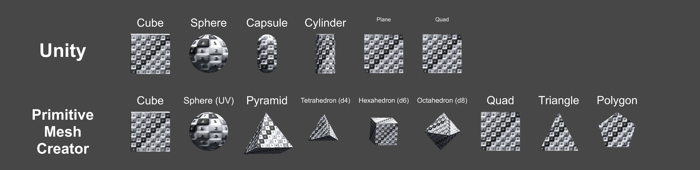
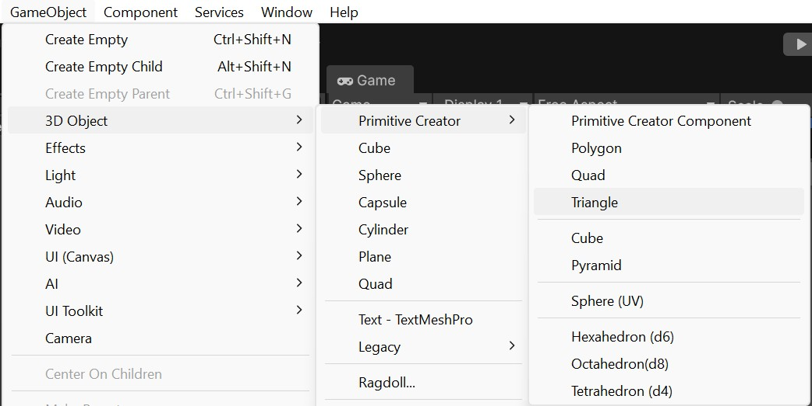
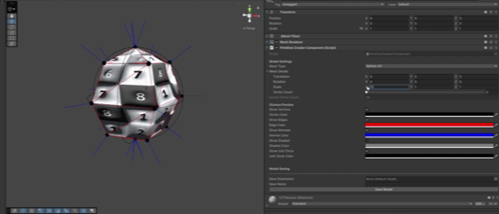
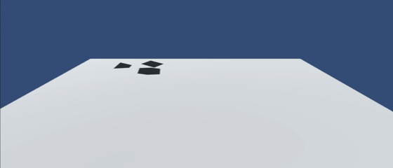

# primitive-mesh-creator
Primitive Mesh Creator is a tool for creating common primitive meshes directly in the Unity 3D engine. The tool offers an expanded set of common primitive shapes (Pyramid, Polyhedra, Triangle, etc) right alongside the default Primitive Objects from Unity (Cube, Sphere, etc.) It also includes a number of tools for creating custom shapes through a simple API or directly in the Unity Editor itself. The tool is also built to extensibly support new shapes with relative ease.



## Features
* Access an extended set of 3D Objects directly in the Unity Toolbar (**Game Object > 3D Object > Primitive Creator**)
* Adds an extended set of 3D Collider components directly in the Add Component menu (**Add Component > Primitive Creator**)
* Create a custom mesh from within the Scene view through the Primitive Creator Component (**Game Object > 3D Object > Primitive Creator Component**)
* Generate a custom mesh within your scripts through the PrimitiveCreatorUtility
* Build a custom mesh type by writing up a custom Mesh Creator script

## Motivations
This package strives to provide a simple extension of Unity’s default set of primitive meshes, without involving more extensive 3D modelling software (Blender, Maya) or a more feature-rich level creation package within Unity (ProBuilder, UModeler). In particular, the package strives to be:
* **Simple to Use**
  - Expanded offerings of default primitives (Polyhedra, Pyramid, etc) are immediately available from within the Editor (**Game Object > 3D Object > Primitive Creator**)
* **Customizable**
  - Create and save a custom mesh from a number of shapes to fit your particular needs, directly from within the Scene view (see **Primitive Creator Component**)
* **Extensible**
  - The package includes a streamlined approach to extending the included set of Mesh Creators, allowing for you to create your own custom procedural mesh creator
* **Standalone**
  - The package uses minimal dependencies or intricate integrations within Unity’s Editor, making it easy to import, make the mesh(es) you need, and remove it if so desired

## Limitations
* Meshes generated within a build can be stored in memory, but not written to file at the moment.
* Meshes bound by the Unit Sphere actually operate with a fixed radius of 0.5. This is to better adhere to Unity’s standard of 1m3 for a shape (1m x 1m x 1m). If you wish to bind a shape by a Unit Sphere with radius of 1, set the scale to (2,2,2) to accomplish the same function.
* The provided set of Colliders are extensions of MeshColliders. As such, these are less performant than Unity’s default PrimitiveColliders (Box, Capsule, Sphere) and should only be used when the standard PrimitiveColliders are not sufficient for your needs. However, they are the smallest possible vertex count that still provides for a viable mesh of that type.
* Primitive Creator Component utilizes the [SerializeReference], which was introduced in Unity 2019.3. Testing has not yet been done for earlier versions of Unity (see [here](https://docs.unity3d.com/2019.3/Documentation/ScriptReference/SerializeReference.html) for more).

## Getting Started
Requires Unity 2019.3 or later.

Install via the Unity Package Manager using the git URL for this repository:
1. Open **Window > Package Manager**
2. Click **+** and select **Add package from git URL...**
3. Enter [[this link](https://github.com/jeremiah-stevens/primitive-mesh-creator.git?path=Packages/com.jeremiah-stevens.primitive-mesh-creator)] and click **Add**

Alternatively, clone or download the repository and add it as a local package via **Add package from disk...**, pointing to the `Packages/com.jeremiah-stevens.primitive-mesh-creator/package.json` file.

## Usage

### Toolbar
The quickest way to add a primitive to your scene. Navigate to **GameObject > 3D Object > Primitive Creator** and select a shape. This creates a GameObject with a mesh, renderer, and appropriate collider already attached.


### Scripting API
Use `PrimitiveCreatorUtility` to create meshes or full GameObjects at runtime or in editor scripts.

```csharp
using PrimitiveCreator;
using static PrimitiveCreator.PrimitiveCreatorUtility;

// Create a mesh directly
Mesh tetrahedron = PrimitiveCreatorUtility.CreateMesh(MeshType.Tetrahedron);

// Create a mesh with custom parameters
MeshCreator.MeshDetails details = PrimitiveCreatorUtility.GetMeshDetails(MeshType.SphereUV);
details.vertexCount = 200;
Mesh sphere = PrimitiveCreatorUtility.CreateMesh(MeshType.SphereUV, details);

// Create a fully configured GameObject (mesh + renderer + collider)
GameObject pyramid = PrimitiveCreatorUtility.CreatePrimitive(MeshType.Pyramid);
```

### Primitive Creator Component
For in-editor mesh customization without scripting, add a **Primitive Creator Component** to any GameObject via **GameObject > 3D Object > Primitive Creator Component**. This lets you adjust the mesh type and vertex count directly in the Scene view and save the resulting mesh as an asset.



### Physics
Each model comes with its own optimized mesh collider, allowing for physics operations on your new objects.



### Extending with Custom Mesh Types
To add a new mesh type, subclass `MeshCreator` and implement the required members. The utility will discover it automatically via reflection.

```csharp
using PrimitiveCreator.MeshCreators;
using static PrimitiveCreator.PrimitiveCreatorUtility;

public class MeshCreatorCustomShape : MeshCreator
{
    public override MeshType MeshType => MeshType.CustomShape; // add to enum
    public override string DisplayName => "Custom Shape";

    public override Mesh CreateMesh(MeshDetails meshDetails)
    {
        // build and return your Mesh here
    }

    public override Mesh CreateColliderMesh(MeshDetails meshDetails)
    {
        // build and return a collider-optimized Mesh here
    }

    public override int GetClosestViableVertexCount(int proposedVertexCount)
    {
        // return the nearest valid vertex count for your shape
    }
}
```

## Contributing
Contributions are welcome. Please submit any bug reports through GitHub Issues or submit any pull requests. If you'd like to contribute a new mesh type, please extend the Mesh Creator pattern.

## License
MIT (see [LICENSE](LICENSE))
